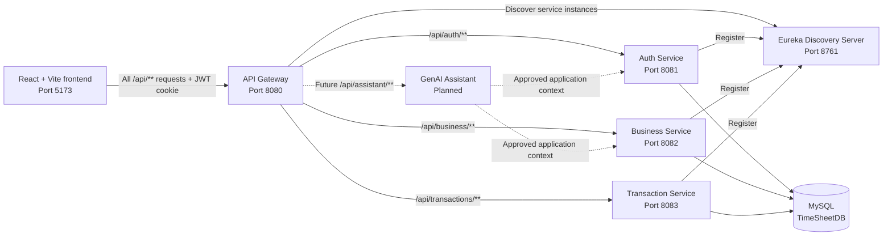
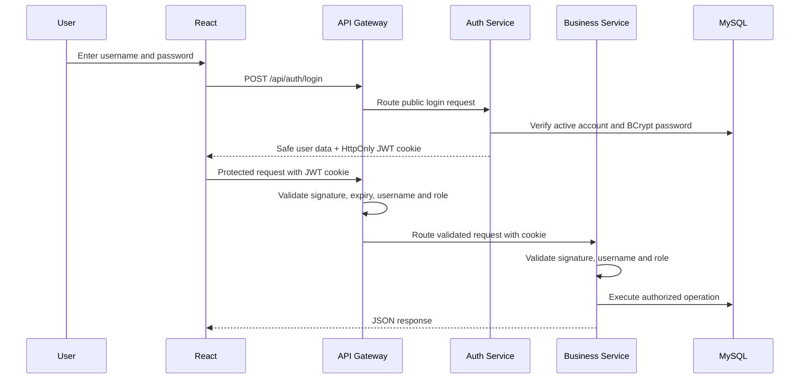

/# TimeX — Time Sheet Management System

TimeX is a role-based workforce and timesheet management platform for managing
users, Clients, Projects, employee assignments, and daily work activities. The
project uses a React frontend and Spring Boot services secured with JWT-based
authentication.

The system is designed around business modules rather than separate codebases
for each role. Roles decide **who can use an operation**, while modules define
**what business capability the operation belongs to**.

## Current implementation status

| Area | Status | Included features |
|---|---|---|
| React frontend | Auth, Business and Transaction modules implemented | Protected role dashboards, Client/Project management, Tasks, Timesheets, Attendance, Complaints and Manager reports |
| Auth Service | Implemented | Registration, approval, login, logout, BCrypt passwords, JWT cookie, role security, active user lookups |
| Business Service | Implemented | Client CRUD, Project CRUD, Manager/Employee scoped Project views, Employee-Project assignments, validation and API errors |
| Transaction Service | Implemented | Tasks, attendance, timesheets, approvals, complaints and Manager reports |
| GenAI Assistant | Planned | Role-aware help, navigation guidance, FAQs and timesheet assistance |

> Employee-to-Project assignment belongs to **Business Service**, because it
> defines the company’s work structure. Transaction Service will record daily
> activities performed inside that structure.

## Problem solved

Organizations often manage Projects, attendance, tasks, and timesheets across
spreadsheets or disconnected applications. TimeX provides one secured system
where:

- Admin reviews HR registrations and supervises protected master data.
- HR creates users, Clients and Projects and assigns Employees to Projects.
- Managers see only Projects and teams that they manage.
- Employees see only Projects assigned to them.
- Transaction Service records daily work, approvals, attendance and complaints.
- A future GenAI assistant will help users understand and use the application.

## Architecture



The frontend calls only API Gateway. Gateway owns the browser CORS policy,
rejects missing, modified, or expired JWT cookies, and uses Eureka to discover
healthy Auth, Business, and Transaction Service instances. Individual services
validate the JWT again and enforce role and record-level authorization. This is
defence in depth: the Gateway protects the common entrance, while each service
still protects itself.

## Why modules are organized by feature, not role

The backend uses modules such as `Client`, `Project`, and `EmployeeProject`
instead of repeating them inside `AdminController`, `HrController`, and other
role controllers.

```text
Controller = What resource are we managing?
Security   = Who is allowed to perform the operation?
```

For example, one `ProjectController` contains Project operations, while
`@PreAuthorize` decides whether Admin, HR, Manager, or Employee can use each
operation. This reduces duplicate code and keeps validation and responses
consistent.

## Services

### Auth Service

Location: `Backend/auth-service`

Auth Service owns user accounts and security. It provides:

- Public HR registration.
- Admin approval or rejection of HR accounts.
- HR registration of Managers and Employees.
- BCrypt password hashing.
- Login and logout.
- JWT creation in an HttpOnly cookie named `jwt`.
- Session restoration through `/api/auth/me` after a browser refresh.
- HR-only lookup lists containing approved, active Managers and Employees.

#### Authentication flow



The login JSON contains only safe fields such as user ID, username, role, and a
message; it does not contain the JWT. The browser cannot read the HttpOnly JWT,
which reduces token exposure to client-side JavaScript. React sends the cookie
automatically using `credentials: "include"`.

#### Auth API summary

| Method | Endpoint | Purpose | Access |
|---|---|---|---|
| POST | `/api/auth/register-hr` | Submit HR registration | Public |
| POST | `/api/auth/login` | Authenticate and create JWT cookie | Public |
| POST | `/api/auth/logout` | Clear JWT cookie | Public |
| GET | `/api/auth/me` | Restore current authenticated session | Authenticated |
| GET | `/api/auth/pending-hr` | List pending HR requests | `ADMIN` |
| PUT | `/api/auth/approve-hr/{id}` | Approve and activate HR | `ADMIN` |
| PUT | `/api/auth/reject-hr/{id}` | Reject HR request | `ADMIN` |
| POST | `/api/auth/register-manager` | Register active Manager | `HR_HEAD` |
| POST | `/api/auth/register-employee` | Register active Employee | `HR_HEAD` |
| GET | `/api/auth/users/managers` | Get active Managers for Project forms | `HR_HEAD` |
| GET | `/api/auth/users/employees` | Get active Employees for assignment forms | `HR_HEAD` |

### Business Service

Location: `Backend/buisness-service`

> The directory currently uses the spelling `buisness-service`. Keep this path
> when running commands. Renaming it should be handled later as a coordinated
> repository change.

Business Service owns organizational/master data:

- Clients.
- Projects.
- Manager and HR ownership of Projects.
- Employee-to-Project assignments.
- Role-level and record-level authorization.
- Consistent `400`, `401`, `403`, `404`, `409`, and `500` error responses.

#### Business API summary

| Method | Endpoint | Access |
|---|---|---|
| POST | `/api/business/clients` | `HR_HEAD` |
| GET | `/api/business/clients` | `ADMIN`, `HR_HEAD` |
| GET | `/api/business/clients/{clientId}` | `ADMIN`, `HR_HEAD` |
| PUT | `/api/business/clients/{clientId}` | `HR_HEAD` |
| POST | `/api/business/projects` | `HR_HEAD` |
| GET | `/api/business/projects` | `ADMIN`, `HR_HEAD` |
| GET | `/api/business/projects/{projectId}` | `ADMIN`, `HR_HEAD` |
| PUT | `/api/business/projects/{projectId}` | `HR_HEAD` |
| GET | `/api/business/projects/my-managed-projects` | `MANAGER` |
| GET | `/api/business/projects/my-assigned-projects` | `EMPLOYEE` |
| POST | `/api/business/employee-projects` | `HR_HEAD` |
| GET | `/api/business/employee-projects` | `HR_HEAD` |
| GET | `/api/business/employee-projects/project/{projectId}` | `HR_HEAD`, owning `MANAGER` |
| GET | `/api/business/employee-projects/employee/{employeeId}` | `HR_HEAD` |
| GET | `/api/business/employee-projects/my-projects` | `EMPLOYEE` |
| DELETE | `/api/business/employee-projects/{employeeProjectId}` | `HR_HEAD` |

See [the complete Business API guide](Backend/buisness-service/BUSINESS_SERVICE_API.md)
for request bodies, responses, validation rules, role permissions, and Postman
examples.

### Transaction Service

Location: `Backend/transaction-service`

Transaction Service owns frequently changing daily activity:

- Tasks created and monitored by Managers.
- Attendance records.
- Employee timesheet submissions.
- Manager approval/rejection of timesheets.
- Complaints and resolution workflow.
- Manager summaries for Employee Tasks and approved work hours.

Implemented ownership:

| Module | Main flow |
|---|---|
| Tasks | Manager assigns work to an Employee on a Project |
| Attendance | Employee records daily attendance |
| Timesheets | Employee records work against an assigned Task |
| Approvals | Owning Manager approves or rejects a Timesheet |
| Complaints | Employee raises an issue and authorized staff resolve it |
| Reports | Manager views progress and Timesheet totals for managed Employees |

Transaction records will refer to authenticated users and valid Business
Service Project assignments. They must not duplicate Client or Project master
data.

See [the complete Transaction API guide](Backend/transaction-service/TRANSACTION_SERVICE_API.md)
for all 21 endpoints, request bodies, permissions, workflows and Postman
examples.

### GenAI Assistant — planned

The planned assistant will provide an in-application chat experience. Example
questions include:

- “How do I submit a timesheet?”
- “Which Projects am I assigned to?”
- “Why was my request rejected?”
- “Where can HR create a new Manager?”
- “Explain the approval workflow.”

Design principles:

- The assistant must use the authenticated user’s role.
- It must not expose another user’s private data.
- It should use approved application documentation and authorized API data.
- It should not directly modify database records without an explicit,
  authorized application action.
- API keys must be stored in environment variables, never committed to Git.
- Answers that affect attendance, approval, or policy should link users to the
  official application workflow.

## Technology stack

| Layer | Technologies |
|---|---|
| Frontend | React 19, Vite 8, React Router, Redux Toolkit, Bootstrap, CSS |
| Backend | Java 21, Spring Boot, Spring Web/MVC, Spring Data JPA, Spring Security, Jakarta Validation |
| Microservices | Spring Cloud Gateway, Netflix Eureka service discovery and load-balanced routing |
| Authentication | JWT (JJWT), HttpOnly cookies, BCrypt |
| Database | MySQL 8, Hibernate/JPA |
| Build tools | Maven Wrapper, npm |
| Development tools | VS Code, Spring Tool Suite, MySQL Workbench, Postman, Git/GitHub |

## Repository structure

```text
WorkPlus1/
├── Backend/
│   ├── auth-service/              # Users, login, JWT and role management
│   ├── buisness-service/          # Clients, Projects and assignments
│   │   └── BUSINESS_SERVICE_API.md
│   ├── transaction-service/       # Tasks, timesheets and daily workflows
│   │   └── TRANSACTION_SERVICE_API.md
│   ├── work-plus-api-gateway/     # Public API routes and centralized CORS
│   └── work-plus-discovery-server/# Eureka service registry
├── Database/
│   ├── P26-Createdb.sql           # Database and table definitions
│   └── P26-Populatedb.sql         # Development sample data
├── Documents/                     # Project documents
├── TimeX/                         # React + Vite frontend
│   └── src/
│       ├── components/            # Public and role-specific UI components
│       └── redux/                 # Authentication state
├── .gitignore
└── README.md
```

## Database model

The SQL schema currently defines:

```text
users
  ├── projects.manager_id
  ├── projects.hr_head_id
  └── employee_projects.employee_id

clients
  └── projects.client_id

projects
  └── employee_projects.project_id

Transaction Service tables:
projects → tasks → timesheets → timesheet_approvals
users    → attendance
users    → complaints
```

All three backend services currently use the same `TimeSheetDB` schema. Business
and Transaction services map user and Project information as read-only
references and do not map user passwords.

## Installation and local setup

### Prerequisites

Install:

- Git.
- Java JDK 21.
- MySQL Server 8.x and optionally MySQL Workbench.
- Node.js 20.19+ and npm.
- Spring Tool Suite or another Java IDE (optional).
- Postman (optional, recommended for API testing).

Verify:

```bash
git --version
java --version
node --version
npm --version
```

### 1. Clone the repository

```bash
git clone https://github.com/devteamproject2026/WorkPlus1.git
cd WorkPlus1
```

### 2. Create the database

For a **new local database only**, open and execute:

```text
Database/P26-Createdb.sql
```

Warning: this script currently starts with `DROP DATABASE IF EXISTS TimeSheetDB`.
Do not run it against a database containing work you need to keep.

The sample population script is intended only for disposable development data.
It currently contains fixed numeric foreign keys and several plain-text sample
passwords, so do not use it as a production seed or rerun it over an existing
database. Prefer creating Managers and Employees through Auth Service, which
automatically hashes passwords.

### 3. Configure environment variables

Local defaults expect:

```text
Database: TimeSheetDB
Username: root
Password: root
Auth port: 8081
Business port: 8082
Transaction port: 8083
API Gateway port: 8080
Eureka port: 8761
```

To override them in PowerShell:

```powershell
$env:DB_URL="jdbc:mysql://localhost:3306/TimeSheetDB"
$env:DB_USERNAME="root"
$env:DB_PASSWORD="your_mysql_password"
$env:JWT_SECRET="your_base64_encoded_secret_of_at_least_32_bytes"
```

Auth, Gateway, Business, and Transaction services must use the exact same
`JWT_SECRET`.

Supported variables:

| Variable | Purpose |
|---|---|
| `DB_URL` | MySQL JDBC URL |
| `DB_USERNAME` | MySQL username |
| `DB_PASSWORD` | MySQL password |
| `JWT_SECRET` | Shared JWT signing/verification secret for Auth, Gateway, Business, and Transaction |
| `JWT_EXPIRATION_MS` | JWT lifetime; local default is 24 hours |
| `COOKIE_SECURE` | Set `true` when HTTPS is enabled so the JWT cookie is HTTPS-only |
| `AUTH_SERVICE_PORT` | Auth Service port |
| `BUSINESS_SERVICE_PORT` | Business Service port |
| `TRANSACTION_SERVICE_PORT` | Transaction Service port; default `8083` |
| `API_GATEWAY_PORT` | Public API Gateway port; default `8080` |
| `DISCOVERY_SERVER_PORT` | Eureka server port; default `8761` |
| `EUREKA_DEFAULT_ZONE` | Eureka registration URL |
| `FRONTEND_ORIGIN` | Browser origin allowed by Gateway CORS |

### 4. Start Eureka Discovery Server

```powershell
cd Backend/work-plus-discovery-server
.\mvnw.cmd spring-boot:run
```

Open `http://localhost:8761` to view registered services.

### 5. Start Auth Service

Using PowerShell:

```powershell
cd Backend/auth-service
.\mvnw.cmd spring-boot:run
```

Or import `Backend/auth-service` into STS and run `AuthServiceApplication` as a
Spring Boot App.

Expected address:

```text
http://localhost:8081
```

### 6. Start Business Service

Open a second terminal:

```powershell
cd Backend/buisness-service
.\mvnw.cmd spring-boot:run
```

Or import the folder into STS and run `CountrySpringBoot1Application` as a
Spring Boot App.

Expected address:

```text
http://localhost:8082
```

### 7. Start Transaction Service

Open a third terminal:

```powershell
cd Backend/transaction-service
mvn spring-boot:run
```

Or import the folder into STS and run `TransactionServiceApplication` as a
Spring Boot App.

Expected address:

```text
http://localhost:8083
```

### 8. Start API Gateway

```powershell
cd Backend/work-plus-api-gateway
.\mvnw.cmd spring-boot:run
```

The browser and Postman use `http://localhost:8080`. Service ports remain
internal development addresses and should not be called by the frontend.

### 9. Start the React frontend

Open another terminal:

```bash
cd TimeX
npm ci
cp .env.example .env
npm run dev
```

Open:

```text
http://localhost:5173
```

### Recommended startup order

```text
1. MySQL
2. Eureka Discovery Server (8761)
3. Auth Service (8081)
4. Business Service (8082)
5. Transaction Service (8083)
6. API Gateway (8080)
7. React frontend (5173)
```

## First-use workflow

1. Register an HR account from `/hr-register`.
2. An Admin approves the pending HR request.
3. The approved HR logs in.
4. HR registers Managers and Employees.
5. HR creates Clients and Projects through Business APIs.
6. HR assigns Employees to Projects.
7. Managers create Tasks; Employees accept them and record progress.
8. Employees submit Timesheets and Managers review them.

For a completely fresh database, an initial Admin account must be securely
bootstrapped with a BCrypt password before step 2. A safe automated Admin seed
is not yet implemented; this is a current setup limitation.

Use the role sidebar to open Business and Transaction workflows in the React
application. The API guides below can also be used for direct Postman testing.

## Postman authentication

1. Send `POST http://localhost:8080/api/auth/login` through API Gateway.
2. Use the original plain password entered during registration.
3. Postman stores the `jwt` cookie for `localhost`.
4. Call every API through `http://localhost:8080`; do not use service ports.
5. No Bearer token is required by the current implementation; authentication
   is read from the cookie.

Typical meanings:

- `401 Unauthorized`: JWT cookie is missing, invalid, or expired.
- `403 Forbidden`: login is valid, but the role cannot use the API.
- `404 Not Found`: a requested record ID does not exist.
- `409 Conflict`: duplicate data or a protected database relationship.

## Build commands

Frontend:

```bash
cd TimeX
npm run lint
npm run build
```

Auth Service:

```powershell
cd Backend/auth-service
.\mvnw.cmd test
```

Business Service:

```powershell
cd Backend/buisness-service
.\mvnw.cmd test
```

Transaction Service:

```powershell
cd Backend/transaction-service
mvn test
```

API Gateway and Discovery Server:

```powershell
cd Backend/work-plus-api-gateway
.\mvnw.cmd test
cd ../work-plus-discovery-server
.\mvnw.cmd test
```

## Roadmap

- Add end-to-end browser tests for Transaction Service workflows.
- Add the role-aware GenAI assistant.
- Add automated Admin bootstrap for fresh environments.
- Replace development defaults with deployment secrets.
- Add automated integration/security tests.
- Add OpenAPI/Swagger documentation if interactive API exploration is needed.
- Add Gateway resilience features such as circuit breakers after deployment
  requirements are defined.
- Move toward database ownership per service if services are deployed
  independently.

## Git workflow

Develop on a personal or feature branch:

```bash
git switch -c feature/short-description
git add <changed-files>
git commit -m "feat: describe the completed change"
git push -u origin feature/short-description
```

Open a Pull Request into `main`. Pull Requests allow teammates to review role
permissions, database effects, and service boundaries before merging.

## Security notes

- Never store plain-text passwords.
- Never commit real database passwords, JWT secrets, or GenAI API keys.
- Use HTTPS and secure cookies in deployment.
- Keep the `JWT_SECRET` synchronized across Auth, Gateway, Business, and
  Transaction services.
- Validate role permissions at the API layer and ownership rules in the service
  layer.
- Do not trust a Manager ID or Employee ID supplied by the frontend when the
  authenticated JWT identity can be used instead.

## Project documentation

- [Business Service API Guide](Backend/buisness-service/BUSINESS_SERVICE_API.md)
- [Transaction Service API Guide](Backend/transaction-service/TRANSACTION_SERVICE_API.md)
- [Database schema](Database/P26-Createdb.sql)
- [Development sample data](Database/P26-Populatedb.sql)

---

TimeX is an academic/team project under active development. The implementation
status above is the source of truth for completed and planned modules.
